# 湾区药械链

> 破解大湾区三地医疗监管差异难题的优化方案

## 一、团队简介

* **团队名称**：安托山九院
* **团队成员**：郑黎彬（深圳大学），王与（深圳大学），伍诚杰（电子科技大学）

## 二、项目简介

湾区药械链是基于目前“港澳药械通”政策而优化设计出的区块链平台，旨在用区块链技术解决原有的政策服务中“数据孤岛”、对境外上市许可持有人（即境外药械研发企业）政策吸引力不足等问题。项目基于个人信息可携带权实现患者和企业资料的可信流转，并通过选择性披露为患者提供隐私保护；构建数据交易平台吸引药械的境外药品上市许可持有人参与构建药械数据库，帮助药械审核进口，为三地居民（特别是在粤港澳大湾区内地工作、学习和生活的港澳同胞）提供已在港澳上市的药品或医疗器械，促进三地医疗用药用械等公共服务的均等化，破解“一国两制三种医疗监管体系”的痛点，推动大湾区一体化向纵深发展。

### 背景引入及痛点分析

1. 在过去，由于很多药品或医疗器械在港澳上市而未在内地上市，因此很多有特殊需求的患者都会去港澳购买或使用在内地没有上市的药械。而疫情后，来回通关可能需要隔离甚至感染新冠，一般患者不愿承担这一风险。

   为了满足部分患者的需要，2020年9月，国家在大湾区内试点先行“港澳药械通”，试点引进临床急需，已在香港、澳门上市，未获国家药监局批准注册，国内已注册品种无法替代的药品与医疗器械。截至目前，“港澳药械通”政策已在粤港澳大湾区内地9市扩展实施一年多，惠及千余人次。

   然而在实践过程中却发现，因为“港澳药械通”只能在广东省内5家指定的医疗机构使用，这给居住在外地的患者带来了极大的不便。由于不同医院间互为“数据孤岛”，患者在外地医院得出诊断结果后，还需要再次来到5家指定医疗机构中的某一家进行二次诊断，增加了患者的成本。其次，因为进口新药的申报只能由5家指定医疗机构向药监局提出，外地医疗机构无权向药监局申报新药的进口。除此之外，目前“港澳药械通”新药械入库后，通知的方式是在其官网或微信公众号上进行发布，而5家医院各有不同的消息发布平台。若未来指定医疗机构数量增加，患者获取消息的途径会更加繁琐，很有可能还会因此错过一些和自己需要的药械有关的重要消息。因此，患者、外地医疗机构与5家指定医疗机构急需一个点对点的平台。

2. 2022年9月1日，粤港澳大湾区内地临床急需进口港澳药品医疗器械预审品种数据库系统正式上线，旨在做好指定医疗机构临床急需进口港澳药品医疗器械申报服务工作，稳步推进“港澳药械通”政策体系建设，提高急需药械相关品种研究资料可及性，缩短申请资料准备时间，提升境外上市许可持有人政策参与积极性。

   然而，由于“一国两制三法域”的客观存在，粤港澳三地医疗监管体系互不相通，患者的医疗数据也不可流通，境外上市许可持有人并不知道内地患者对于哪些药械处于急需的状态，造成了一定程度上的“数据孤岛”。其次，目前的预审库虽然提供了让境外上市许可持有人上传资料的平台，将以往“政府急需药械时才找企业”转变成了“企业可以先把药械交给政府审核”，一定程度上赋予了企业主动权，但政府部门对于境外上市许可持有人主动提交资料却没有设置合理的激励措施。

   除此之外，根据2022年6月20日开始实施的《粤港澳大湾区内地指定医疗机构非首次使用临床急需进口港澳药品医疗器械申报指南》（如图 1所示），政府部门（药监局和卫健委）对境外上市许可持有人提交的资料进行“并联”式的审批，其中包括药监局组织专家对药械进行评审。专家评审过程中，资料的验真对于专家决定是否引进药械非常重要。而目前“港澳药械通”政策并没有单独设计对源文件的验真流程，猜测应该是由专家团队以自身专业知识对内容真假进行辨别，这并不利于加快审批和简化流程。因此保证境外上市许可持有人上传文件的真实性也要是一大要务。

   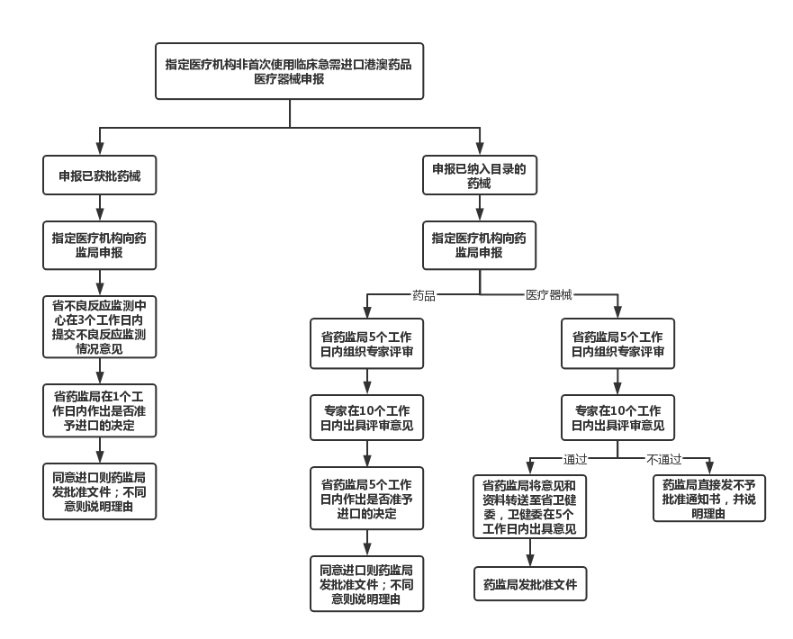

   

### 解决思路

1. 对于外地患者信息的收集，我们可以将现存的相关患者信息以隐私保护和可信的方式收集到指定的5家医疗机构的数据库里，这样可以方便后面对所需药械下的患者数量进行一个统计。统计的意义在于让政府部门、医疗机构和境外上市许可持有人都可以明确内地现存患者的需求量，解决“数据孤岛”或信息不对称的问题。5家指定医疗机构之间要对收集到的患者信息形成共识，这样若新药械到货，指定医疗机构可根据数据库中的患者披露的信息第一时间将消息发送给患者。

2. 对于境外上市许可持有人提交文件的验真问题，我们可以通过香港卫生署和澳门药监局的公信力作为背书，对境外上市许可持有人提交的部分文件进行可信验真。验真的意义在于加快专家评审进程。其实现思路与第一点较为类似，是基于个人信息可携带权和分布式数据传输协议DDTP。

3. 对于境外上市许可持有人的激励措施，我们可以设立一个积分数据交易平台，境外上市许可持有人根据其帮助患者数量获得积分，积分可以在药监局处换取到指定医疗机构的一些重要的资料文件如临床资料等。这些文件可以对境外上市许可持有人未来建立在内地上市运行的可行体系起到参考和帮助。

## 三、系统架构

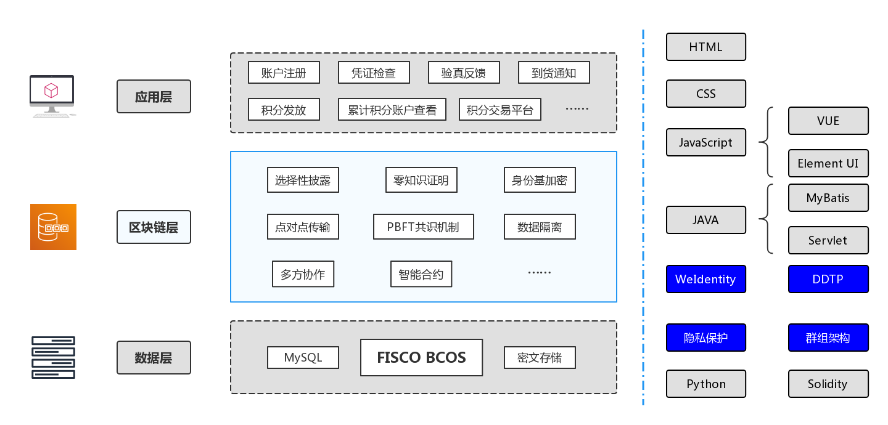

### 关键技术

在我们设计的多个不同业务中，可以发现在共识过程中并不是每个节点都需要处理所有的交易。如果我们将湾区药械链作为主链的话，那么其下的外地患者数据收集业务、指定医疗机构共识业务、境外上市许可持有人提交文件的验真业务以及积分交易平台业务就处在不同的分片链中，同一片区（业务）内的处理是同步的、一致的，不同片区（业务）之间则可以是异步的。

而FISCO BCOS底层平台上有一个很好的实现办法，就是群组架构，是对不同业务进行分组隔离。它可以从区块链上拉出一个局部共识的独立账本，群组间通过网络准入和账本白名单实现信息数据相互隔离，而群也可以扩容。

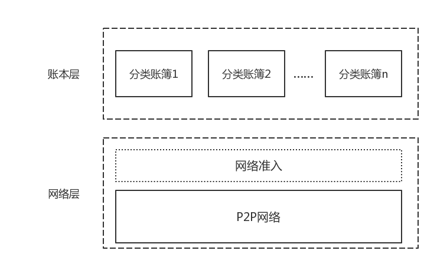

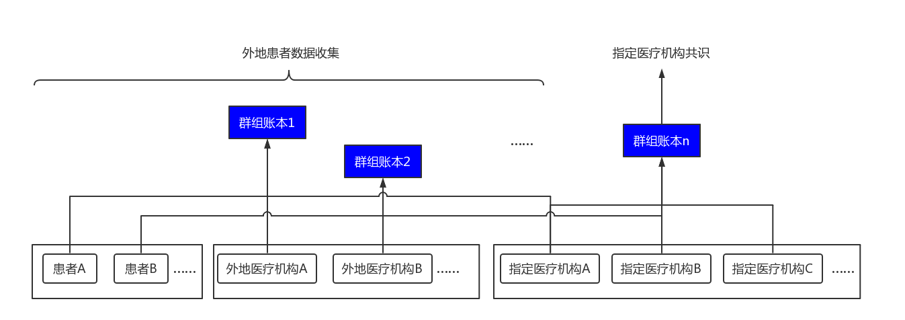

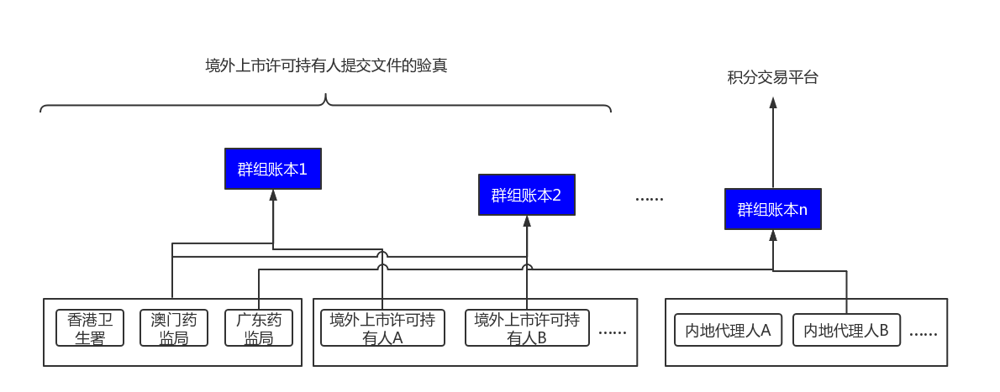

### 开发思路及功能特色

#### ①患者资料验证

各地的医疗机构申请加入联盟链，每家医疗机构均持有公私钥对`(PK SK)`由CA（卫健委）颁发的CA数字证书作为医疗机构的链上的身份认证凭证。CA 数字证书包含了该证书拥有者的身份、签名、有效期等。不同CA数字证书拥有者的身份在链上操作的权限也不同。对“港澳药械通”的药械有需求的患者在各地医疗机构就诊时通过客户端注册得到身份序号，即id。

基于个人信息可携带权、DDTP以及WeIdentity组件，通过外地医疗机构为患者做信用背书，我们设计若外地医疗机构诊断出患者确实需要“港澳药械通”的药物，则由医院医生先在客户端创建和填写患者的个人电子病历(Electronic Health Record,EHR)、电子健康记录（Electronic Medical Record, EMR）（如图 6所示）或其他诊断文件，然后根据指定医疗机构发布的关于在此类药械信息收集上的选择性披露策略对文件内容进行有选择的披露，最后生成两份凭证：比如一份是患者的明文电子病历凭证，另一份是患者经选择性披露后的电子病历凭证。

外地医疗机构根据明文电子病历凭证上患者的信息通过身份基加密（IBE）发送给外地患者，外地患者收到两份文件后进行核对确认，确认后将经选择性披露后的电子病历凭证用指定医疗机构的公钥进行加密，链下点对点发送给指定医疗机构审核，同时委托外地医疗机构将经选择性披露后的电子病历的哈希值用其私钥签名后上链。指定医疗机构在收到外地患者发来的文件后用自己的私钥进行解密，解密得出经选择性披露后的电子病历凭证，然后指定医疗机构自己进行哈希运算生成消息摘要；同时将链上的数字签名下载，用外地医疗机构的公钥进行验证，得到另外一个哈希值；然后根据哈希函数“数据指纹”的特性，将两个哈希值进行对比，如果相同则文件为真，不同则文件为假。

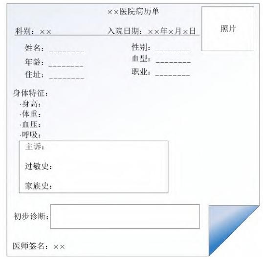

综上所述，患者数据验证运行过程如图 7所示：

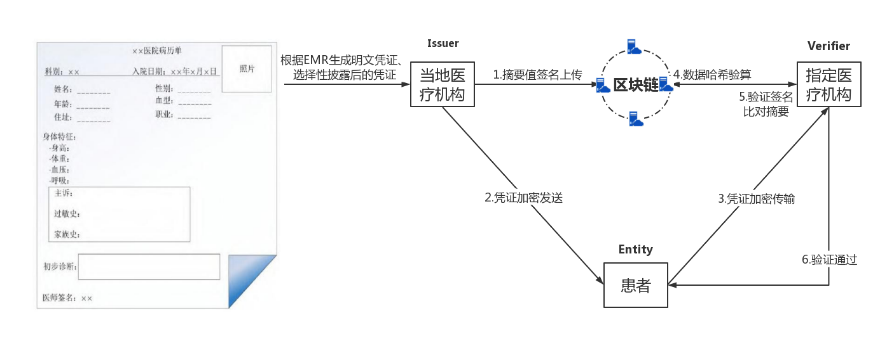

#### ②指定医疗机构共识

5家指定医疗机构需要通过PBFT机制形成共识，如图 8和图 9所示。由于指定医疗机构要验证明文信息真实性并统计数量，因此患者传输的资料在5家医疗机构的共识过程中均为明文形式。

具体来说：任意一家指定医疗机构在收到关于患者资料并审核确认后，将资料的Hash值和患者id等信息打包成一个交易，放入交易池。交易池中暂时存放了各个节点已提交但尚未入块的所有交易。指定医疗机构分为权威医院和从医院。权威医院由共识算法选取，权威医院负责患者信息的存储，并将存储内容与从医院达成一致。在系统初始时，生成私钥和公钥并计算相关值。当收集到足够多资料后，权威医院将交易池中的所有交易打包成一个新区块，提交给从医院，通过PBFT的预准备、准备、提交3个阶段达成共识，确认新区块的合法性后将其添加到区块链的尾部。

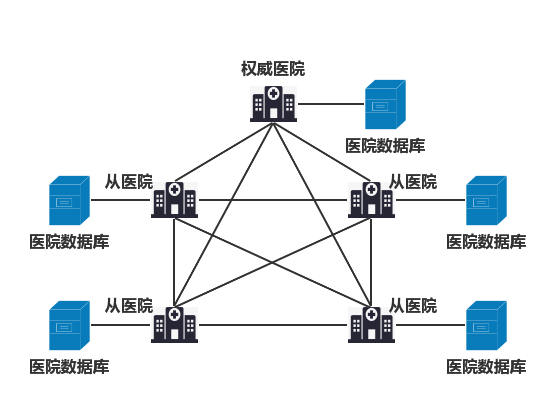

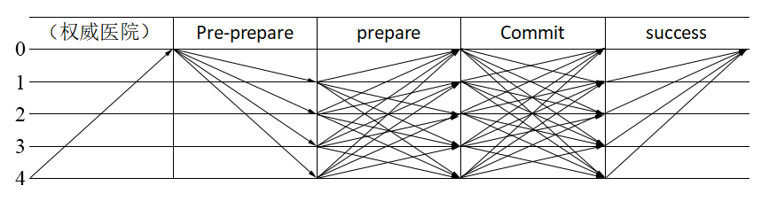

#### ③境外上市许可持有人资料验证

基于个人信息可携带权、DDTP以及WeIdentity组件，我们设计香港卫生署、澳门药监局与广东省药监局、卫健委共建CA认证中心，由其颁发的CA数字证书作为监管单位和境外上市许可持有人（或者其授权的在中国境内的企业法人）在港澳数据验证合约中的身份认证凭证，其中包含该证书拥有者的数字签名、公钥信息和身份信息。

根据预审库提交文件的要求，具体来说，境外上市许可持有人需要提交的文件有：

* 《粤港澳大湾区内地临床急需进口港澳药品品种数据库申请表》或者《粤港澳大湾区内地临床急需进口港澳医疗器械品种数据库申请表》

* 《粤港澳大湾区内地临床急需进口港澳药品品种数据库资料清单》或者《粤港澳大湾区内地临床急需进口港澳医疗器械品种数据库资料清单》

  * 香港或者澳门地区允许上市的批准证明文件

  * 药品的包装、标签、说明书样本，及产品完整实样图片
  * 药品不良反应概述
  * 临床使用综述
  * 人种差异使用风险评估
  * ……

* 承诺书

因为境外上市许可持有人已经在港澳上市，这些文件大部分已经在香港卫生署或澳门药监局提交并受其验证过。因此，境外上市许可持有人可以利用企业信息的可携带权，结合区块链并通过政府部门的公权力背书实现资料跨境数据验真。而这有利于缩短广东省药监局及其专家团队的评审压力，因为目前对境外上市许可持有人上传文件的验真主要还是基于专家团队的专业素养，而目前评审过程时间短任务重。若能在评审之前在一定程度上确定药械资料的真实性将有助于缩短评审时间并简化评审流程。

港澳数据验证与患者资料验证在思路上一脉相承，如图 10所示。具体来说，境外上市许可持有人委托香港卫生署或澳门药监局将资料文件哈希加密并用自己的私钥签名后上链；同时，境外上市许可持有人用广东省药监局的公钥加密后点对点传输给广东省药监局；广东省药监局收到数据后用自己的私钥解密文件，并将其进行哈希运算得出散列值；广东省药监局从链上下载签名后的数据，用香港卫生署或澳门药监局的公钥进行验证后，对比两个散列值是否相同，若相同则文件为真，反之为假。从而在一定程度上保证了资料文件的可信，在流程上也减少了专家评审过程中对资料以经验进行验真的工作，加快了审核进程。

值得一提的是，目前类似的项目“粤澳跨境数据验证平台”正是基于FISCO BCOS的开发的国产开源区块链底层平台进行验证。若该项目未来能够接入香港并提供数据接口的话，本项目便可以直接跨链进行数据验真，进一步加快大湾区数据要素的流通。

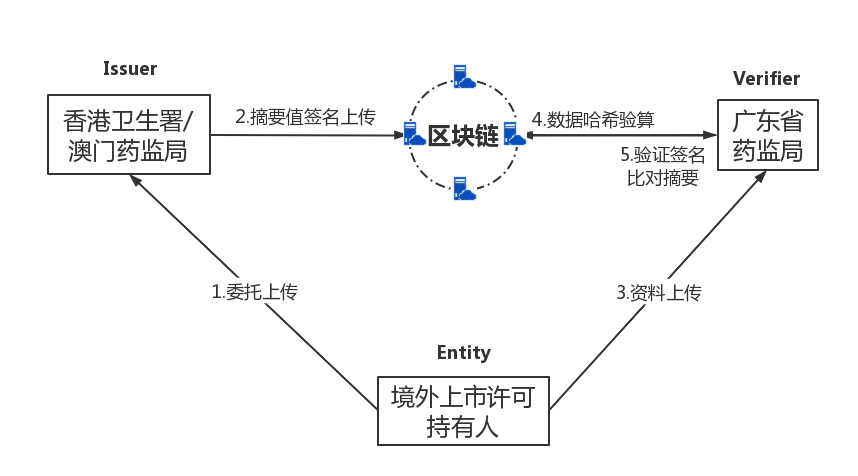

#### ④积分交易

对于境外药品上市许可持有人的激励措施设置，我们的想法如图 11所示：

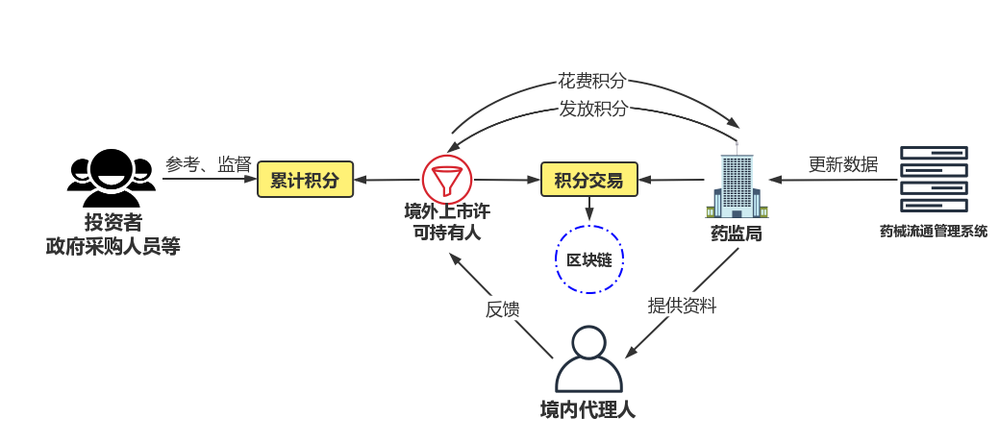

境外药品上市许可持有人上传资料文件完善数据库后，若药品审核通过并成功引进，则根据实际帮助患者数量发放积分，积极响应的企业可以获得额外积分。积分发放过程为药监局根据目前已有的“粤港澳大湾区临床急需进口药械流通管理系统”中上传的药械使用数据定期进行发放。属于企业自己“挖”得的累计积分不会清零，累计积分的意义在于体现企业的社会责任感，可以作为评价企业ESG质量时的重要指标之一，为未来投资者投资或政府采购时提供重要参考。获得的积分会进入积分账户，积分账户的积分可以用于交易。境外药品上市许可持有人如果就其药械在未来希望在内地注册上市，则需要在内地寻找境内代理人。而一定数量的积分可以在广东省药监局换取其药械在指定医疗机构使用过程中产生的临床数据、生产销售、上市后研究评价、风险管理等情况的一定数量的资料文件，并可由药监局直接分享给境内代理人，帮助境内代理人快速建立起在内地运行的可行体系。

> 境内代理人：是指取得我国药品注册证书的境外持有人依法指定，代表其履行法律法规规定的药品上市许可持有人义务的中国境内企业法人。依据我国法律规定：境内代理人需负责建立并实施药品年度报告制度，代表境外持有人每年将境外持有人确认后的相关药品在中国境内的生产销售、上市后研究评价、风险管理等情况按照规定向代理人注册地所在的省级药品监督管理部门报告。

## 四、商用价值

本作品旨在破解大湾区三地医疗监管差异难题，实现公共服务的均等化，推动大湾区一体化向纵深方向发展。除了服务于社会层面，本作品也可以同商业场景有机结合，具体有两个实际应用：真实世界研究和商业保险支付。

真实世界研究（Real World Study, RWS）是对药物、医疗器械或技术在真实医疗环境/临床应用场景中产生的数据进行系统性收集，并采用循证医学、临床/药物流行病学等方法开展的研究，包括观察性研究和试验性研究。在湾区药械链上产生的数据以区块链不可篡改的特性为真实世界研究提供了真实可信且极具研究意义的大量临床数据。而这些临床数据对于真实世界研究价值十分重大的原因在于此类药械在国内并未上市，而由于触及商业机密，境外上市许可持有人不一定会将资料悉数上传给药监局，因此真实世界研究院可直接获取到的数据源极少。若“港澳药械通”政策配套湾区药械链，并将数据可信流转出售给真实世界研究院等企业或机构，此类数据不仅可以给企业或研究机构带来价值更为重大的利润，而且未来也会对我国公共卫生安全等领域也会起到理论指导的作用。

融入了区块链元素的“港澳药械通”政策也可以在商业保险下发挥重大作用。目前在“港澳药械通”进一步推广的过程中，也存在着临床急需进口使用药械价格高昂的难点和阻力，尤其是境外原研的抗肿瘤新药对于患者的经济负担较重。“港澳药械通”如果和区块链、商业保险一同设计的话一方面可以有效确保商业保险过程中的事件发生的真实性与不可篡改性，有效遏制“骗保”等问题的发生，推动“港澳药械通”与更多商业保险支付进行探索；另一方面，商业保险的加入也可以有效减轻患者的经济负担，让患者可以以更亲民的价格用药用械，更好地保障患者身体健康和生命安全，改善患者生活品质，提升患者福祉水平。

